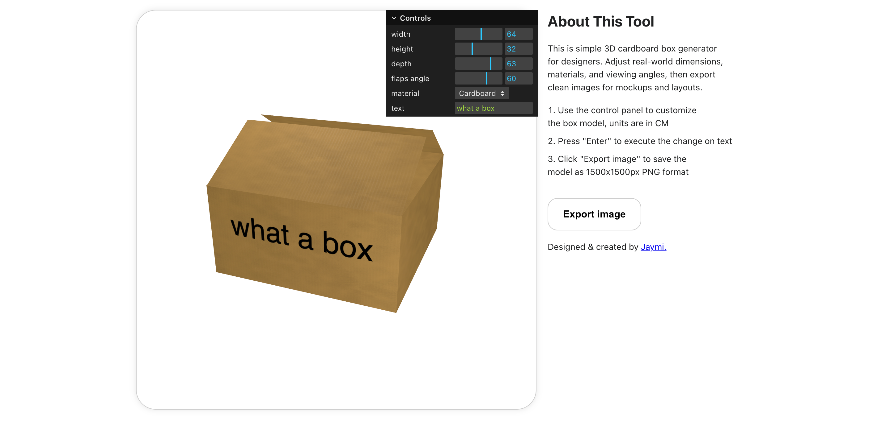

# Cardboard Box Generator

This a is simple 3D cardboard box generator for designers. Adjust real-world dimensions, materials, and viewing angles, then export clean images for mockups and layouts. This project was inspired by my own needs working as s packaging designer for realistic carton box images to use as design mockups or internal reference purposes. Creating such boxes in Adobe tools is possible but I reckon that it is not efficient and produce sub-optimal outputs, hence the idea of this tool.

Live demo: [Click Here](https://jaymiyam.com/cardboard-box-generator/)

## Screenshot

## Features

User can customize below parameters and see instant 3D preview

- Dimensions: width, depth, height of the box
- Top flaps opening angle
- Box texture: cardboard / kraft paper / recycled paper
- Text: word display render on front side of the box

After customization, the app supports **exporting the 3D preview to PNG image** for further design or other purposes.

## Tech Stack

- Javascript
- Vite
- Three.js - Javascript 3D library
- lil-gui - Run-time UI control panels library

## Learning Summary

- Dynamic 3D model configurator set-up with Three.js
- Object-oriented programming & code-splitting
- GUI interactions & 3D scene update on dynamic values
- HTML canvas to image download with desired resolutions & format
- CSS responsive design skills
